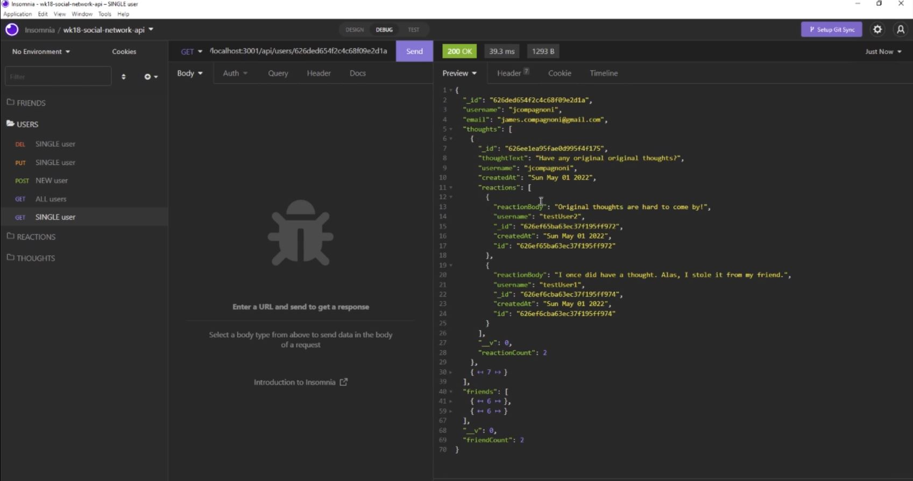

[](https://opensource.org/licenses/MIT)
  # Social Network API
  ## Project Description
  This repository holds the code for a simple social network API. Because the focus of this repo is to demonstrate knowledge and a grasp of the back-end of a possible web application, there is no front-end or deployed app. The interested party would need to incorporate a REST API client such as Insomnia or Postman to test the API routes and simulate client-side server requests. In brief, Node.js is paired with the server framework Express.js to establish API routes and the corresponding HTTP request methods; a NoSQL, MongoDB database is paired with the object-document mapper (ODM) Mongoose for holding the data and defining the schema/models, respectively. A user can create a thought, a reaction to another user's thought, add and remove friends; routes have also been built for getting all users and thoughts, and deleting users and thoughts. 
  ## Table of Contents
  * [Installation](#installation)
  * [Usage](#usage)
  * [License](#license)
  * [Contribute](#contributions)
  * [Tests](#tests)
  * [Questions?](#questions)
  ## Installation
  After cloning or downloading a local copy of the repository, from a terminal install the required dependencies that are listed in the package.json file:
  ```
  npm install
  ```
  Once the node_modules folder is created and all dependencies are downloaded, type the following in your terminal:
  
  ```
  npm start
  ```
  The *start* command effectively stands in for running "node index.js" as shown in the "scripts" property in the package.json file you download.
    
  ## Usage
  This repository's code can be used as a framework for the interested party who wishes to create their own server-side API for some web application that allows for users to posts commentary, responses to other users' commentary, etc.<br>
   See the screenshotb below of getting a single user's informatione.<br>
  
  ## License
  <p align="center">Copyright 2022</p>
    <p align="center">=======================================</p><br>
    <details>
    <summary>Click for the legal stuff, if that's <em><strong>your thing</strong></em></summary>
    Copyright <YEAR> James Compagnoni

Permission is hereby granted, free of charge, to any person obtaining a copy of this software and associated documentation files (the "Software"), to deal in the Software without restriction, including without limitation the rights to use, copy, modify, merge, publish, distribute, sublicense, and/or sell copies of the Software, and to permit persons to whom the Software is furnished to do so, subject to the following conditions:

The above copyright notice and this permission notice shall be included in all copies or substantial portions of the Software.

THE SOFTWARE IS PROVIDED "AS IS", WITHOUT WARRANTY OF ANY KIND, EXPRESS OR IMPLIED, INCLUDING BUT NOT LIMITED TO THE WARRANTIES OF MERCHANTABILITY, FITNESS FOR A PARTICULAR PURPOSE AND NONINFRINGEMENT. IN NO EVENT SHALL THE AUTHORS OR COPYRIGHT HOLDERS BE LIABLE FOR ANY CLAIM, DAMAGES OR OTHER LIABILITY, WHETHER IN AN ACTION OF CONTRACT, TORT OR OTHERWISE, ARISING FROM, OUT OF OR IN CONNECTION WITH THE SOFTWARE OR THE USE OR OTHER DEALINGS IN THE SOFTWARE
    </details>
  Legalese borrowed from <a href="https://opensource.org/licenses/MIT" target="_blank">here</a>.

  ## Contribute
  Please email me with any suggestions.

  ## Tests
  n/a

  ## Questions?
  I enjoy hearing back about my work. You can reach me at jcomp_03@yahoo.com.
  Alternatively, contact me on my GitHub page <a href="https://github.com/jcomp-03">here</a>.
  
